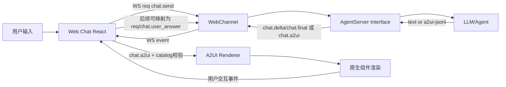

# JiuwenClaw 集成 A2UI（v0.9）设计说明

## 1) Audit Report（代码与协议审计）

### 代码审计结论
- 前端技术栈：`jiuwenclaw/web/package.json` 显示是 React + Vite + TypeScript。  
- 传输层：`webClient` 基于 WebSocket，协议帧分为 `req/res/event`。  
- 聊天消息渲染：`useWebSocket.ts` 监听 `chat.delta/chat.final`，`MessageItem.tsx` 负责实际展示。  
- 后端出口：`channel/web_channel.py` 将后端 Message 统一封装为 WS event 帧。  
- 现有生态：仓内有 `e2a` 协议实现，但 Web 聊天窗口当前是直接 WS，不是 A2A 端到端。

### A2UI 文档审计结论（外部）
- A2UI 是声明式数据协议，不执行任意代码；依赖受信任 catalog。  
- A2UI 与 A2A / AG-UI 兼容；当前建议保持最小改动，先沿用 JiuwenClaw 现有 WS。  
- 本次按 v0.9 目标实现，默认 catalog 固定为 `https://a2ui.org/specification/v0_9/basic_catalog.json`。  

## 2) Backend Changes

### A2UIResponseBuilder
- 新增 `jiuwenclaw/agentserver/a2ui.py`：
  - `A2UIResponseBuilder`：支持 `create_surface`、`create_component`、`update_components`、`to_jsonl_lines`。
  - `extract_a2ui_jsonl_lines`：从 LLM 文本（含 fenced block）提取合法 JSONL 行。
  - `is_a2ui_text`：检测是否为 A2UI 输出。

### Agent 流式解析改造
- `jiuwenclaw/agentserver/interface.py` 中 `_parse_stream_chunk` 增加：
  - 若 chunk 文本识别为 A2UI，则发出 `event_type="chat.a2ui"`。
  - payload 携带 `jsonl: string[]`，支持多行渐进到达。

## 3) Transport Changes

- 新增事件类型 `chat.a2ui`（`schema/message.py`）。
- `channel/web_channel.py` 将 `chat.a2ui` 视为结构化事件透传，避免被降级为纯文本 `content`。
- 仍保留现有 `type=event` 帧结构，最小改动实现：
  - 文本：`event=chat.delta/chat.final`
  - A2UI：`event=chat.a2ui`, `payload.jsonl=[...]`

## 4) Frontend Changes

- `Message` 类型新增 `a2uiLines?: string[]`（`web/src/types/message.ts`）。
- `useWebSocket.ts` 新增 `chat.a2ui` 处理：
  - 若当前存在流式气泡，合并 `a2uiLines` 并结束 streaming。
  - 否则插入新的 assistant 消息（`content=""` + `a2uiLines`）。
- 新增 `A2UIRenderer.tsx`：
  - 只接受受信任 catalog。
  - 只渲染白名单组件类型（Card/Text/Button/TextField/DatePicker/Table）。
  - 默认不执行 HTML/JS，仅做安全受控的数据渲染。
- `MessageItem.tsx`：
  - 若消息含 `a2uiLines`，优先渲染 A2UI 组件；否则走原 Markdown 文本渲染。
- 历史恢复 `historyRestore.ts` 支持 `chat.a2ui` 的消息还原。

## 5) LLM System Prompt Snippet

已注入 `prompt_builder.py` 的 `_a2ui_prompt`，核心规则：
- 何时输出 A2UI、何时输出纯文本。
- 必须 JSONL，首行 `createSurface`。
- 固定 v0.9 catalog。
- 强制 fenced block：` ```a2ui-jsonl ... ``` ` 作为传输识别信号。

## 6) 测试用例

### pytest（后端）
`tests/unit_tests/test_a2ui.py`：
1. Builder 最小 payload：校验 `createSurface` + `createComponent`。  
2. fenced block 解析：校验可提取 JSONL 且补齐 version。  
3. stream chunk 识别：`answer` 中 A2UI 输出应映射到 `chat.a2ui`。  

### 前端手工测试建议
1. 纯文本回复：应仍显示 Markdown 文本气泡。  
2. A2UI 表单：发送 date picker/card JSONL，应显示结构化组件块。  
3. A2UI 按钮交互：点击按钮后事件需按现有请求链路回传后端（可在后续迭代接入 action 桥接）。  
4. 流式 A2UI：分多批 `chat.a2ui` 行发送，UI 应增量更新。  

## 7) 架构图



> HarmonyOS/ArkUI 兼容建议：保持后端事件与 transport 不变，仅替换前端 renderer 适配层即可。

